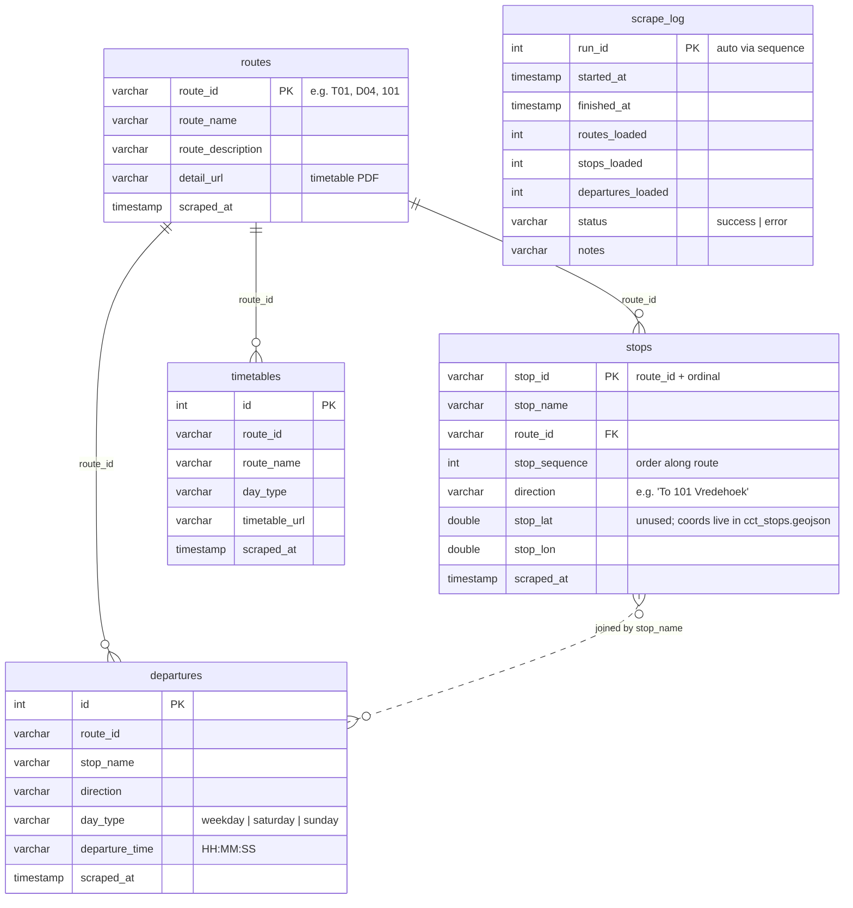

# 🚌 MyCiTi Bus Timetable

A Streamlit app for exploring Cape Town's MyCiTi bus network: search any stop,
see its upcoming departures, and browse an interactive map of the whole system
overlaid on the city.

The official MyCiTi site only publishes timetables as PDFs. This project
scrapes those PDFs into a queryable database and adds the tools the site
doesn't have — live "next bus" lookups, a visual departure timeline, and a
clickable geographic system map.

## Features

- **Stop search** — type a partial name, pick a stop, see every route serving it
- **Upcoming departures** — next 10 buses per route and direction, filtered to
  the current time in Cape Town (weekday / Saturday / Sunday–public holiday
  timetables, defaulting to today's)
- **Departure map** — a timeline chart of every departure of the day per
  route/direction, with a marker at the current time, so frequency, peak
  bunching and the last bus are visible at a glance
- **Interactive system map** — the full network on real Cape Town geography
  (Leaflet + CARTO tiles), with a toggle between:
  - *Schematic*: square-ish 45°/90° lines in the style of the official route map
  - *Street*: the exact road-following route geometries from city open data

  Click a route in the legend to highlight it; click any stop to open its
  timetable. Stops sit at their true coordinates (~96% geolocated).

## How it works

```
myciti.org.za route-timetable PDFs
        │  scraped + parsed (requests, pdfplumber)
        ▼
data/myciti.duckdb  ◄── City of Cape Town open data (stop coordinates,
        │               street route geometries: data/cct_*.geojson)
        ▼
Streamlit app (app.py) ── Leaflet custom component (map_component/)
```

- `etl/scrape_myciti.py` downloads every route's timetable PDF and parses the
  tables (one row per stop; day type and direction read from page headers).
- `etl/load_db.py` loads routes, stops and ~170k departure times into DuckDB.
- `system_map.py` builds the map network: stop order along each route is
  reconstructed from the timetable itself (the first trip of the day visits
  stops in sequence), then stops are matched by name to the city's official
  stops layer for coordinates.
- `map_component/index.html` is a bidirectional Streamlit custom component —
  clicking a stop on the map sends its name back to Python.

## Database schema



`departures` is the core fact table (~170k rows) the app queries; `stops` ↔
`departures` join on `stop_name` rather than a foreign key because the PDFs
identify stops only by name. `scrape_log` is a standalone audit table, one
row per ETL run.

## Getting started

Requires Python 3.10+.

```bash
# 1. Install dependencies
pip install -r requirements.txt

# 2. Build the database (scrapes myciti.org.za — takes a few minutes)
python3 run_etl.py

# 3. Run the app
streamlit run app.py
```

`run_etl.py --inspect` prints what's in the database without re-scraping.
Re-run the ETL whenever MyCiTi updates their timetables.

## Project structure

```
├── app.py                    # Streamlit app (search, timetables, map tabs)
├── system_map.py             # System-map graph builder + component wrapper
├── map_component/
│   └── index.html            # Leaflet map frontend (custom component)
├── etl/
│   ├── scrape_myciti.py      # PDF scraper/parser
│   └── load_db.py            # DuckDB loader
├── run_etl.py                # One-command ETL pipeline
├── data/
│   ├── cct_stops.geojson     # Stop coordinates (City of Cape Town open data)
│   ├── cct_routes.geojson    # Street route geometries (City of Cape Town)
│   └── myciti.duckdb         # Built by run_etl.py (not committed)
└── requirements.txt
```

## Data sources & credits

- Timetables: [MyCiTi](https://www.myciti.org.za) route timetable PDFs
- Stop coordinates & route geometries:
  [City of Cape Town Open Data Portal](https://odp-cctegis.opendata.arcgis.com/)
- Basemap tiles: [CARTO](https://carto.com/attributions) /
  [OpenStreetMap](https://www.openstreetmap.org/copyright) contributors

This is an unofficial hobby project, not affiliated with MyCiTi or the City of
Cape Town. Timetable data is only as fresh as the last ETL run — always check
official sources before travelling.

## Known limitations

- Timetable-based only — no real-time vehicle tracking
- Public holidays follow the Sunday timetable but are not auto-detected
- A few of the newest routes/stops are missing from the city's open-data
  layers: 4 routes fall back to straight dashed lines in street mode, and
  ~23 stops are not shown on the map (they still appear in search)

## License

[MIT](LICENSE)
