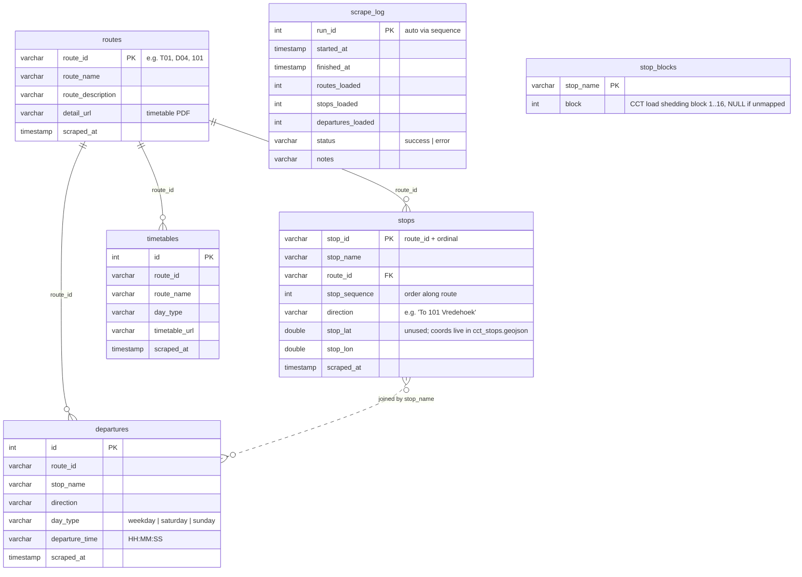

# 🚌 MyCiTi Bus Timetable

A custom, responsive Flask website for exploring Cape Town's MyCiTi bus
network, alongside the original Streamlit application. The website uses the
same Python timetable and network logic, with its own static HTML, CSS, and
JavaScript frontend. The Streamlit app remains available for its additional
features, including the departure timeline and load-shedding analysis.

The official MyCiTi site only publishes timetables as PDFs. This project
scrapes those PDFs into a queryable database and adds timetable-based journey
planning, upcoming departures, and an interactive geographic system map.

## Website features

- **Journey planner** — choose origin and destination stops, a travel day
  (weekday, Saturday, or Sunday/public holiday), and browse upcoming or
  fastest journeys, or all scheduled journeys for the day. Direct journeys
  show departure, arrival, duration, and route. When there is no direct
  service, timetable-based transfer suggestions show the legs and changeover
  stops; they are suggestions, not guaranteed connections.
- **Stop departures** — choose a stop without a destination to see upcoming
  departures grouped by route and direction, using Cape Town local time.
- **Interactive route map** — explore routes and stops on Leaflet with CARTO
  basemap tiles. Switch between street geometries from City of Cape Town open
  data and a schematic line view, filter the map by route category, and select
  a stop to use it as the journey origin.
- **Static frontend assets** — the Flask app serves `website/index.html`,
  `website/styles.css`, and `website/app.js` at the site root and under
  `/assets/`.

## Streamlit features not in the custom website

The original Streamlit interface (`app.py`) remains available locally and
includes features not implemented in the custom website:

- **Departure timeline** — visualize the day's departures for a stop by
  route and direction, with the current time marked on the chart.
- **Load-shedding awareness** — view the Eskom stage and show schedule-based
  impacts on journey results, stop departure boards, and the departure
  timeline when stop-block data is available.
- **Streamlit map components** — the Streamlit journey view includes a map
  for transfer itineraries, in addition to its system map.

## How it works

```
myciti.org.za route-timetable PDFs
        │  scraped + parsed (requests, pdfplumber)
        ▼
data/myciti.duckdb  ◄── City of Cape Town open data (stop coordinates,
        │               street route geometries: data/cct_*.geojson)
        ├── Flask API (webapp.py) ── website/ (static Leaflet frontend)
        └── Streamlit app (app.py) ── map_component/
```

- `etl/scrape_myciti.py` downloads every route's timetable PDF and parses the
  tables (one row per stop; day type and direction read from page headers).
- `etl/load_db.py` loads routes, stops and ~170k departure times into DuckDB.
- `system_map.py` builds the map network: stop order along each route is
  reconstructed from the timetable itself (the first trip of the day visits
  stops in sequence), then stops are matched by name to the city's official
  stops layer for coordinates.
- `map_component/index.html` is a bidirectional Streamlit custom component —
  clicking a stop on the map sends its name back to Python.
- `webapp.py` serves the custom website and JSON API. `/api/bootstrap` provides
  stop options, route geometry, and snapshot metadata; `/api/journey` returns
  direct journeys or transfer suggestions; `/api/stop` returns upcoming
  departures; `/api/health` is a health check.
- If `data/myciti.duckdb` does not exist, the Flask app creates it from the
  committed Parquet files in `data/snapshot/`. The website uses this timetable
  snapshot; it does not scrape PDFs or provide real-time vehicle tracking.

## Database schema


```mermaid
erDiagram
    routes ||--o{ stops : "route_id"
    routes ||--o{ departures : "route_id"
    routes ||--o{ timetables : "route_id"
    stops }o..o{ departures : "joined by stop_name"

    routes {
        varchar route_id PK "e.g. T01, D04, 101"
        varchar route_name
        varchar route_description
        varchar detail_url "timetable PDF"
        timestamp scraped_at
    }
    stops {
        varchar stop_id PK "route_id + ordinal"
        varchar stop_name
        varchar route_id FK
        int stop_sequence "order along route"
        varchar direction "e.g. 'To 101 Vredehoek'"
        double stop_lat "unused; coords live in cct_stops.geojson"
        double stop_lon
        timestamp scraped_at
    }
    departures {
        int id PK
        varchar route_id
        varchar stop_name
        varchar direction
        varchar day_type "weekday | saturday | sunday"
        varchar departure_time "HH:MM:SS"
        timestamp scraped_at
    }
    timetables {
        int id PK
        varchar route_id
        varchar route_name
        varchar day_type
        varchar timetable_url
        timestamp scraped_at
    }
    scrape_log {
        int run_id PK "auto via sequence"
        timestamp started_at
        timestamp finished_at
        int routes_loaded
        int stops_loaded
        int departures_loaded
        varchar status "success | error"
        varchar notes
    }
    stop_blocks {
        varchar stop_name PK
        int block "CCT load shedding block 1..16, NULL if unmapped"
    }
```

`departures` is the core fact table (~170k rows) the app queries; `stops` ↔
`departures` join on `stop_name` rather than a foreign key because the PDFs
identify stops only by name. `scrape_log` is a standalone audit table, one
row per ETL run.

## Run locally

Requires Python 3.10+. Install the shared dependencies once:

```bash
pip install -r requirements.txt
```

Start the custom Flask website:

```bash
python webapp.py
```

Open `http://localhost:5000`. The Flask server builds its local DuckDB
database from the committed Parquet snapshot if needed; no scraping is needed.

Start the original Streamlit app instead:

```bash
streamlit run app.py
```

## Free website hosting

The repository includes a Render Blueprint (`render.yaml`) that provisions a
free Python web service:

1. Sign in to [Render](https://render.com/) with GitHub.
2. Create a new **Blueprint** and select this repository.
3. Review the service settings from `render.yaml` and deploy.

**Deployment note:** the current Blueprint starts `fastapi_app.main:app` with
Uvicorn; it does not launch the custom Flask website. To deploy the Flask
website with a Blueprint, update `render.yaml`'s `startCommand` to
`gunicorn webapp:app` before connecting the Blueprint (the Flask app reads
Render's `PORT` environment variable). The website uses the committed
timetable snapshot and needs no paid database or API key. Render's free
services can spin down when idle, so the first request after a quiet period
may take longer.

The Blueprint also defines `ESP_API_KEY` for the FastAPI/Streamlit
load-shedding feature; it is not required by the custom Flask website.

To refresh the data from myciti.org.za (takes a few minutes):

```bash
python3 run_etl.py
```

The ETL rebuilds the database **and** re-exports the snapshot — commit the
updated `data/snapshot/*.parquet` files so deployments pick up the new
timetables. `run_etl.py --inspect` prints what's in the database without
re-scraping.

## Project structure

```
├── app.py                    # Original Streamlit app
├── webapp.py                 # Flask website server and JSON API
├── website/
│   ├── index.html            # Website shell
│   ├── app.js                # Journey, departures, and Leaflet map UI
│   └── styles.css            # Website styles
├── render.yaml               # Free Render Blueprint (currently FastAPI)
├── fastapi_app/              # FastAPI service configured by the Blueprint
├── system_map.py             # Shared network builder + Streamlit map wrapper
├── journey.py                # Shared journey and transfer search logic
├── disruption.py             # Streamlit load-shedding assessment
├── ls_ui.py                  # Streamlit load-shedding controls
├── map_component/
│   └── index.html            # Leaflet frontend for the Streamlit component
├── etl/
│   ├── scrape_myciti.py      # PDF scraper/parser
│   ├── load_db.py            # DuckDB loader
│   └── build_stop_blocks.py  # Optional stop-to-loadshedding-block mapping
├── run_etl.py                # One-command ETL pipeline
├── data/
│   ├── cct_stops.geojson     # Stop coordinates (City of Cape Town open data)
│   ├── cct_routes.geojson    # Street route geometries (City of Cape Town)
│   ├── snapshot/             # Parquet snapshot — app rebuilds the DB from it
│   └── myciti.duckdb         # Built from snapshot or ETL (not committed)
└── requirements.txt
```

## Streamlit load-shedding details

The Streamlit sidebar shows the load shedding stage in use. The
effective stage is resolved in this order:

1. **Manual override**: pick a stage (0 to 8) in the sidebar selectbox.
   Useful for "what if" checks and for when the API is unavailable.
2. **Live stage**: with the selectbox on Auto and an API key configured,
   the app reads the national Eskom stage from the
   [EskomSePush API](https://eskomsepush.gumroad.com/l/api) every 30
   minutes (48 calls/day, inside the free tier's 50/day allowance).
3. **Default**: without an override or API key, the app assumes stage 0.

The badge under the selectbox names the source in use: `manual override`,
`live · EskomSePush`, or `assumed · no API key`.

To enable the live source, create `.streamlit/secrets.toml`:

```toml
ESP_API_KEY = "your-eskomsepush-key"
```

or set the `ESP_API_KEY` environment variable. API failures never break
the Streamlit app: the stage falls back to the next source in the list.

### Mapping stops to load shedding blocks

Load shedding in Cape Town rotates through 16 city-defined area blocks.
To know which block each bus stop sits in, the ETL can join stop
coordinates against the city's block polygons:

1. Download the **Load shedding areas** dataset as GeoJSON from the
   [City of Cape Town Open Data Portal](https://odp-cctegis.opendata.arcgis.com/).
2. Save it as `data/cct_loadshedding_areas.geojson`.
3. Rerun the mapping step:

   ```bash
   python3 etl/build_stop_blocks.py   # or the full pipeline: python3 run_etl.py
   ```

This produces a `stop_blocks` table (and
`data/snapshot/stop_blocks.parquet`). Stops that fall outside every
polygon keep a NULL block. The step is optional: without the polygon
file, `run_etl.py` skips it and the Streamlit app simply carries no block data.
No block assignments are ever guessed.

### How disruption is assessed

`disruption.py` generates the standard City of Cape Town 16-block
rotational schedule from three data constants: 12 daily slots starting
every 2 hours, a 2 h 30 outage per slot, and the published per-stage
block offsets (the pattern behind the city's "all areas" schedule
table). The base block advances by one each slot, so day 17 repeats
day 1.

A connection is flagged when the bus is scheduled to be at a stop while
that stop's block is shed. The model's assumptions:

- Each end is checked as a point in time (departure moment at the
  origin, arrival moment at the destination), not the whole ride span.
- An affected end adds a 10 minute delay buffer (traffic lights are
  usually down around a shedding stop), capped at 20 minutes total.
  This is a heuristic, not a measured delay.
- Overnight GTFS times (a 24:15:00 departure) are checked against the
  next day's schedule, matching the timetable convention used
  throughout the app.
- Stops with an unknown block are never flagged, and stage 0 disables
  the whole model.

### What the flags mean in Streamlit

When the effective stage is above 0 and block data is available in the
Streamlit app:

- An amber **⚡ Stage-affected** chip on a journey card means the bus is
  scheduled to be at the origin or destination stop while that stop's
  block is shed. The caption under the card names the end, its block,
  and the shedding window; the amber duration next to the scheduled one
  (for example `~24 min (+20 buffer)`) adds the delay buffer.
- A warning banner on a stop's departure board lists today's shedding
  windows for that stop's block.
- Amber bands on the departure map shade those windows on the time
  axis, so you can see which departures fall inside them.

At stage 0 none of this appears, and the app looks exactly as it does
without the feature. The same applies when the block mapping has not
been built (see the ETL section above): the flags simply stay off. The
flags are schedule-based estimates, not live outage reports.

## Data sources & credits

- Timetables: [MyCiTi](https://www.myciti.org.za) route timetable PDFs
- Stop coordinates & route geometries:
  [City of Cape Town Open Data Portal](https://odp-cctegis.opendata.arcgis.com/)
- Basemap tiles: [CARTO](https://carto.com/attributions) /
  [OpenStreetMap](https://www.openstreetmap.org/copyright) contributors

This is an unofficial hobby project, not affiliated with MyCiTi or the City of
Cape Town. Timetable data is only as fresh as the last ETL run — always check
official sources before travelling.

## Known limitations

- Timetable-based only — no real-time vehicle tracking
- Public holidays follow the Sunday timetable but are not auto-detected
- The custom website does not include the Streamlit departure timeline or
  load-shedding UI; those are available only in `app.py`
- A few of the newest routes/stops are missing from the city's open-data
  layers: 4 routes fall back to straight dashed lines in street mode, and
  ~23 stops are not shown on the map (they still appear in search)
- In the Streamlit app, load-shedding flags always use today's date (the
  day-type selector carries no day of month) and check each journey end as a
  point in time; the delay buffer is a fixed heuristic, not a prediction
- Transfer suggestions are timetable-based, not guaranteed connections:
  they assume a 3 minute minimum changeover, cap waits at 45 minutes,
  search at most two transfers, and try the nearest few changeover stops
  per line pair rather than every possibility

## License

[MIT](LICENSE)
